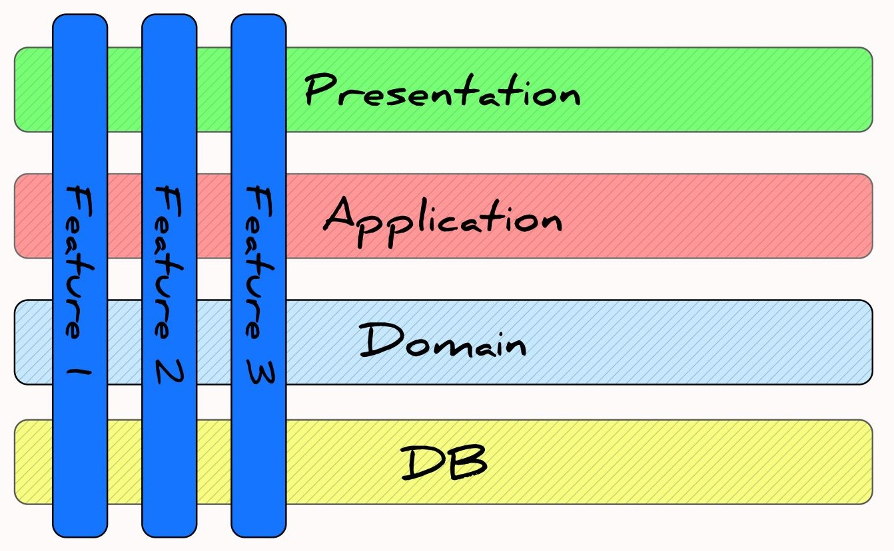

## :fire: FIAP | Desafio - TechChallenge One
O objetivo do desafio é construir uma aplicação que seja possível realizar o gerenciamento de contatos, podendo assim, cadastrar, atualizar, excluir e até listar (podendo filtrar por DDD de cada região do Brasil).

## :stop_sign: Requisitos
### Funcionais
- Cadastrar um contato deve exigir a obrigatoriedade dos campos de Nome, E-mail, Telefone e DDD
- Atualizar um contato deve exigir a obrigatoriedade dos campos de Id Contato, Nome, E-mail, Telefone e DDD
- Excluir um contato deve exigir o Id do Contato
- Listar contatos deve ter como parametro opcional poder informar o DDD
### Não funcionais
- Criar uma aplicação em .NET 8
- Utilizar de ORM ou Micro ORM (EF Core ou Dapper)

## :woman_technologist: Tecnologias
- .NET 8
- Entity Framework Core 8
- FluentValidator
- MediatR
- Teste de unidade
- Unit Of Work

## :building_construction: Arquitetura 
- **Application**: CQRS, interfaces para serviços externos, pipeline behaviors e validações de comandos.com fluent validator
- **Domain**: Classes compartilhadas, entidades, objetos de valor, interface de repositorios e mensagens de erros
- **Infrastructure**: Camada de acesso a dados, cache e classes concretas de acesso a serviços externos
- **Application.UnitTests**: Testes unitário para classes de comandos, queries e validações
- **Domain.UnitTests**: Testes unitário para entidades e objetos de valor




## :bookmark: Métodos

#### :bangbang: ATENÇÃO :bangbang:
Propriedade que esteja marcado com o ícone :small_orange_diamond: é de preenchimento obrigatório

<details>
    <summary>[GET - Lista contatos]</summary>

`{urlbase}/api/v1/contatos`

- #### Caso de sucesso
    - Retornado lista de Contatos podendo filtrar por Ddd

- #### Use Case
    - Caso o `ddd` seja informado e não seja um valor válido, será retornado um Bad Request informando que o Ddd não é válido

- #### Query Params
    - **ddd** | string: Deve ser informado o ddd que deseja obter os contatos

- #### Exemplo Request
    - ##### Response - Será retornado uma lista
    ```
    [
        {
            "contatoId": "1e6fd294-5ad2-4d4c-8c2b-2bc23a5f45bc",
            "nome": "Gabriel Teste",
            "email": "teste@tes.com.br",
            "telefone": "956432451",
            "ddd": 21
        },
        {
            "contatoId": "7119a005-575f-4316-bcf4-c0b435b711f6",
            "nome": "Andre Teste",
            "email": "andre@tes.com.br",
            "telefone": "956432453",
            "ddd": 11
        }
    ]
    ```
    - ##### Response - Caso filtrado por ddd = 11
    ```
    [
        {
            "contatoId": "1e6fd294-5ad2-4d4c-8c2b-2bc23a5f45bc",
            "nome": "Gabriel Teste",
            "email": "teste@tes.com.br",
            "telefone": "956432451",
            "ddd": 11
        },
        {
            "contatoId": "7119a005-575f-4316-bcf4-c0b435b711f6",
            "nome": "Andre Teste",
            "email": "andre@tes.com.br",
            "telefone": "956432453",
            "ddd": 11
        }
    ]
    ```
    - ##### Use Case - Ddd inválido
    ```
    {
        "type": "https://tools.ietf.org/html/rfc7231#section-6.5.1",
        "title": "CodigoRegiao.ValorInvalido",
        "status": 400,
        "detail": "O valor informado para DDD não é valido"
    }
    ```
</details>
<details>
    <summary>[POST - Inserir contato]</summary>
    
`{urlbase}/api/v1/contatos`

- #### Caso de sucesso
    - Inseri dados de contato na tabela com associação para ddd

- #### Use Case
    - Caso o `ddd` informado não exista, será retornado um 404 NotFound informando que não existe

- #### Validators
    - Caso o `email` informado não esteja em um formato válido, será retornado um 400 BadRequest 
    - Caso o `nome` informado não esteja em um formato válido, será retornado um 400 BadRequest  
    - Caso o `telefone` informado não esteja em um formato válido, será retornado um 400 BadRequest  
    - Caso o `ddd` informado não seja informado no padrão válido, será retornado um 400 BadRequest

- #### Atributos
    - :small_orange_diamond: **nome** | String: Deve ser informado o nome do contato
    - :small_orange_diamond: **email** | String: Deve ser informado o e-mail do contato
    - :small_orange_diamond: **telefone** | String: Deve ser informado o telefone do contato
    - :small_orange_diamond: **ddd** | String: Deve ser informado o ddd

- #### Exemplo Request
    - ##### Válido
    ```
    {
        "email": "teste@tes.com",
        "nome": "Gabriel Teste",
        "telefone": "956432451",
        "ddd": "11"
    }
    ```
    - ##### Response - Será retornado um Guid com o Id do contato
    ```
    "28eb0baa-e67a-4f64-86e1-cfa1326301c6"
    ```
    - ##### Validator - Email inválido
    ```
    {
        "type": "https://tools.ietf.org/html/rfc7231#section-6.5.1",
        "title": "Email.FormatoInvalido",
        "status": 400,
        "detail": "Email está inválido"
    }
    ```
    - ##### Validator - Nome inválido
    ```
    {
        "type": "https://tools.ietf.org/html/rfc7231#section-6.5.1",
        "title": "Nome.NomeIncompleto",
        "status": 400,
        "detail": "Informe o nome completo"
    }
    ```
    - ##### Validator - Telefone inválido
    ```
    {
        "type": "https://tools.ietf.org/html/rfc7231#section-6.5.1",
        "title": "Telefone.FormatoInvalido",
        "status": 400,
        "detail": "Formato inválido, deve ser fornecido 9########"
    }
    ```
     - ##### Validator - Ddd inválido
    ```
    {
        "type": "https://tools.ietf.org/html/rfc7231#section-6.5.1",
        "title": "CodigoRegiao.ValorInvalido",
        "status": 400,
        "detail": "O valor informado para DDD não é valido"
    }
    ```
     - ##### Use Case - ddd não encontrado
    ```
    {
        "type": "https://tools.ietf.org/html/rfc7231#section-6.5.1",
        "title": "Ddd.NaoEncontrado",
        "status": 400,
        "detail": "Ddd não encontrado para o Valor = '19' informado"
    }
    ```
</details>
<details>
    <summary>[PUT - Atualizar contato]</summary>
    
`{urlbase}/api/v1/contatos`

- #### Caso de sucesso
    - Atualiza dados de contato

- #### Use Case
    - Caso o `contatoId` informado não exista, será retornado um 404 NotFound informando que o contato não existe
    - Caso o `ddd` informado não exista, será retornado um 404 NotFound informando que não existe

- #### Validators
    - Caso o `email` informado não esteja em um formato válido, será retornado um 400 BadRequest 
    - Caso o `nome` informado não esteja em um formato válido, será retornado um 400 BadRequest  
    - Caso o `telefone` informado não esteja em um formato válido, será retornado um 400 BadRequest  
    - Caso o `ddd` informado não seja informado no padrão válido, será retornado um 400 BadRequest

- #### Atributos
    - :small_orange_diamond: **contatoId** | Guid: Deve ser informado o Id do contato
    - :small_orange_diamond: **nome** | String: Deve ser informado o nome do contato
    - :small_orange_diamond: **email** | String: Deve ser informado o e-mail do contato
    - :small_orange_diamond: **telefone** | String: Deve ser informado o telefone do contato
    - :small_orange_diamond: **ddd** | String: Deve ser informado o ddd

- #### Exemplo Request
    - ##### Válido
    ```
    {
        "email": "teste@tes.com",
        "nome": "Gabriel Teste",
        "telefone": "956432451",
        "ddd": "11"
    }
    ```
    - ##### Response - Será retornado um 204 NoContent
    ```
    ```
    - ##### UseCase - Contato não encontrado
    ```
    {
        "type": "https://tools.ietf.org/html/rfc7231#section-6.5.4",
        "title": "Contatos.NaoEncontrado",
        "status": 404,
        "detail": "O contato com Id = '8cefc269-a3a4-46a0-bf81-351d3d220ca4' não foi encontrado"
    }
    ```
    - ##### Validator - Email inválido
    ```
    {
        "type": "https://tools.ietf.org/html/rfc7231#section-6.5.1",
        "title": "Email.FormatoInvalido",
        "status": 400,
        "detail": "Email está inválido"
    }
    ```
    - ##### Validator - Nome inválido
    ```
    {
        "type": "https://tools.ietf.org/html/rfc7231#section-6.5.1",
        "title": "Nome.NomeIncompleto",
        "status": 400,
        "detail": "Informe o nome completo"
    }
    ```
    - ##### Validator - Telefone inválido
    ```
    {
        "type": "https://tools.ietf.org/html/rfc7231#section-6.5.1",
        "title": "Telefone.FormatoInvalido",
        "status": 400,
        "detail": "Formato inválido, deve ser fornecido 9########"
    }
    ```
     - ##### Validator - Ddd inválido
    ```
    {
        "type": "https://tools.ietf.org/html/rfc7231#section-6.5.1",
        "title": "CodigoRegiao.ValorInvalido",
        "status": 400,
        "detail": "O valor informado para DDD não é valido"
    }
    ```
     - ##### Use Case - ddd não encontrado
    ```
    {
        "type": "https://tools.ietf.org/html/rfc7231#section-6.5.1",
        "title": "Ddd.NaoEncontrado",
        "status": 400,
        "detail": "Ddd não encontrado para o Valor = '19' informado"
    }
    ```
</details>

<details>
    <summary>[DELETE - Exclui um cadadastro de contato]</summary>
    
`{urlbase}/api/v1/contatos/{contatoId}`

- #### Caso de sucesso
    - Atualiza dados de contato

- #### Use Case
    - Caso o `contatoId` informado não exista, será retornado um 404 NotFound informando que o contato não existe

- #### Parametros
    - :small_orange_diamond: **contatoId** | Guid: Deve ser informado o Id do contato

- #### Exemplo Request
    - ##### Response - Será retornado um 204 NoContent com body vazio
    ```
    ```
    - ##### UseCase - Contato não encontrado
    ```
    {
        "type": "https://tools.ietf.org/html/rfc7231#section-6.5.4",
        "title": "Contatos.NaoEncontrado",
        "status": 404,
        "detail": "O contato com Id = '8cefc269-a3a4-46a0-bf81-351d3d220ca4' não foi encontrado"
    }
    ```
</details>

## :warning: Requisitos
- [Docker Desktop](https://www.docker.com/products/docker-desktop/) ou [SSMS](https://learn.microsoft.com/pt-br/sql/ssms/download-sql-server-management-studio-ssms?view=sql-server-ver16)
    - Recomendação de uso do Docker, é muito simples obter uma imagem do SQL, basta seguir esse [link](https://balta.io/blog/sql-server-docker)
- [Visual Studio 2022](https://visualstudio.microsoft.com/pt-br/downloads/)
- [SDK .NET 8](https://github.com/dotnet/core/blob/main/release-notes/8.0/8.0.4/8.0.4.md?WT.mc_id=dotnet-35129-website)
- [Postman](https://www.postman.com/downloads)
- [Azure Data Studio](https://learn.microsoft.com/pt-br/azure-data-studio/download-azure-data-studio?tabs=win-install%2Cwin-user-install%2Credhat-install%2Cwindows-uninstall%2Credhat-uninstall)

## :zap: Running
1. Clone o projeto do Github para sua maquina local
2. Com o projeto aberto, exclua a pasta de Migrations que fica na camada de infrastructure se e somente se existir essa pasta
3. Alterar conexão com o banco de dados no arquivo de appsettings.development.json que fica na camada de API
4. No menu de ferramentas do Visual Studio clicar em View > Others > Package Manager Console
    - Selecionar o projeto de Infrastructure
    - Executar o comando o `add-migration inicial`
    - Após geração do script, executar o comando `update-database`
5. Executar o projeto, caso prefira, você pode optar por importar a collection no seu postman que está dentro do projeto na pasta de collections
6. Caso execute o projeto em modo Debug, na primeira vez será executado um insert inicial com todos os DDDs do Brasil
